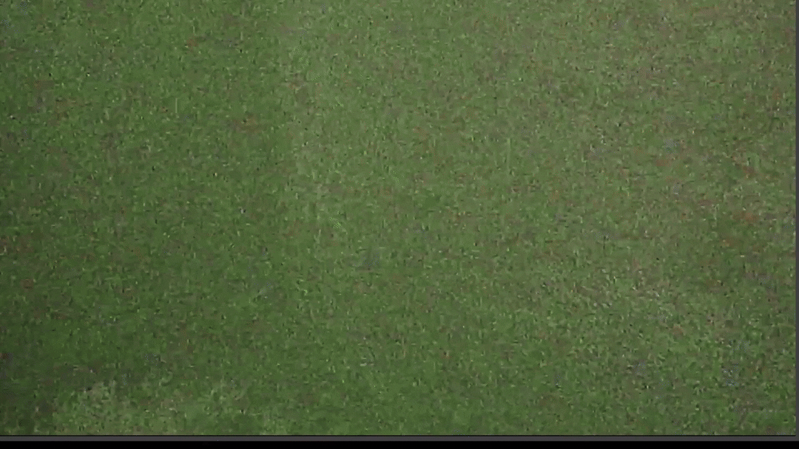
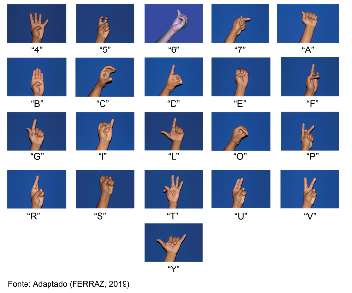

# Tradutor de Libras para Português 🎥🤟
Este projeto é um protótipo de **reconhecimento automático da Língua Brasileira de Sinais (Libras)**, desenvolvido como Trabalho de Conclusão de Curso em Engenharia de Software na Universidade Santo Amaro (UNISA).  
O sistema utiliza **MediaPipe**, **OpenCV** e **Scikit-Learn** para detectar e classificar o parâmetro linguístico **Configuração de Mão (CM)** em vídeos, contribuindo para futuras soluções de tradução automática de Libras para a língua portuguesa.

 

---

## 📚 Contexto

A Libras é reconhecida por lei como meio oficial de comunicação da comunidade surda. Apesar disso, ainda existem poucos sistemas capazes de traduzir Libras para o português de forma automática.  
Este projeto busca preencher essa lacuna, explorando técnicas de **visão computacional** e **aprendizado de máquina** para interpretar sinais em tempo real.

---

## 🎯 Objetivos

- Detectar e classificar automaticamente as **Configurações de Mão (CM)** da Libras.
- Utilizar **MediaPipe** para rastreamento da mão e extração de pontos de referência.
- Treinar modelos de **Machine Learning** com **Scikit-Learn** para classificação das configurações.
- Avaliar a acurácia e desempenho do sistema em testes experimentais.

---

## 🛠️ Tecnologias Utilizadas

- **Python 3.12.10**
- [MediaPipe](https://developers.google.com/mediapipe) – Biblioteca de visão computacional
- [Scikit-Learn](https://scikit-learn.org/stable/) – Ferramentas de aprendizado de máquina
- **OpenCV** – Captura e processamento de imagens
- **NumPy** – Manipulação de dados numéricos

---

## 📂 Estrutura do Projeto

├── dados/               # Base de imagens coletadas  
├── src/                 # Código-fonte principal  
│   ├── coleta.py        # Coleta de imagens via webcam  
│   ├── criacao_dados.py # Processamento e criação da base de dados  
│   ├── treino.py        # Treinamento do modelo (Random Forest)  
│   ├── reconhecimento.py# Reconhecimento em tempo real  
├── modelo.p             # Modelo treinado (gerado após treino)  
├── dados.pickle         # Base de dados processada  
├── requirements.txt     # Dependências do projeto  
└── README.md            # Documentação  

---

## 🚀 Como Executar
1. **Clone este repositório**:
   ```bash
   git clone https://github.com/seuusuario/tcc-tradutor-libras-prototipo.git
   cd tcc-tradutor-libras-prototipo
   ```
2. **(opcional) Crie um ambiente virtual para manter as dependências isoladas**:
- Criando o ambiente virtual:
   ```bash
   python -m venv venv
- Ativando o ambiente no Windows:
  ```bash
  venv\Scripts\activate
- Ativando o ambiente o Linux/Mac:
  ```bash
  source venv/bin/activate

3. **Instale as dependências**:
- Este projeto utiliza um arquivo `requirements.txt` para listar todas as bibliotecas necessárias.  
Assim, você não precisa instalar cada pacote manualmente. 
   ```bash
   pip install -r requirements.txt

4. **Coleta de imagens**:
- Coleta de imagens que servirão como base de dados.
- Pressione Q para iniciar a captura de cada classe.
- Para esse projeto, foram definidas 21 classes baseadas nas configurações de mão do alfabeto manual e dos números ordinários, são 100 imagens por classe. Elas serão listadas no próximo tópico e devem ser replicadas na ordem apresentada.

```bash
python src/coleta.py
```

5. **Criação da base de dados**:
- Utiliza as imagens da etapa anterior para extrair os pontos de referência da mão com MediaPipe, normaliza as coordenadas e salva em dados.pickle. Eles servirão como base de dados para o treinamento do modelo. 
```bash
python src/criacao_dados.py
```

6. **Treinamento do modelo**:
- Treina um classificador Random Forest, exibe a acurácia e salva o modelo em modelo.p.
```bash
python src/treino.py
```

7. **Reconhecimento em tempo real**
- Utiliza a webcam para detectar e classificar sinais, exibindo o caractere correspondente na tela.
- Reproduza os sinais ilustrados no próximo tópico para ver o resultado

```bash
python src/reconhecimento.py
```

---

## 🤟 Sinais utilizados no projeto
- Para esse projeto, foram definidas 21 classes baseadas nas configurações de mão do alfabeto manual e dos números ordinários. Todas as configurações de mão estão listadas na imagem abaixo:

 

---

## 📊 Resultados

- Foram coletadas **21 configurações de mão** para treinamento inicial.  
- O protótipo apresentou **desempenho satisfatório**, com acurácia superior a 90% em testes.  
- Limitações identificadas:
  - Base de dados reduzida.  
  - Reconhecimento limitado a uma mão por vez.  
  - Necessidade de evolução da arquitetura para aplicações reais.  

---

## 🔮 Trabalhos Futuros

- Expansão da base de dados com mais configurações e sinais.  
- Implementação de reconhecimento de **movimento, orientação e expressões não-manuais**.  
- Testes com diferentes algoritmos de aprendizado de máquina.  
- Integração com sistemas de tradução automática para português.  

---

## 👨‍💻 Autor

**Gabriel Borges Reinaldo**  
Bacharelando em Engenharia de Software – Universidade Santo Amaro (UNISA)  
Orientador: Prof. Me. Angelo Luiz da Cruz Oliveira  

---

## 📜 Licença

Este projeto está sob a licença MIT. Veja o arquivo `LICENSE` para mais detalhes.
